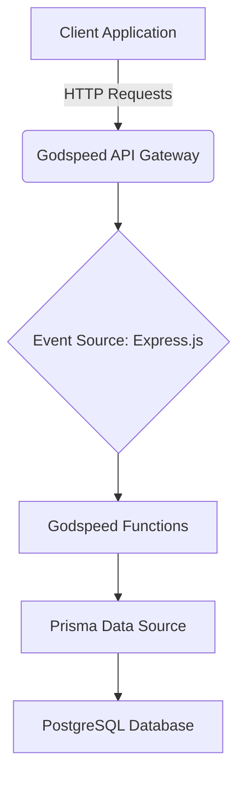

## Project: Personal Task Manager API

### 1. Introduction
*   **Project Overview**: A brief description of the Task Manager API as a backend service.
*   **Purpose**: To provide a robust and scalable API for individual users to manage their personal tasks.
*   **Scope**: This PRD focuses on the backend API functionalities for user and task management. It does not cover any frontend UI.

### 2. Goals
*   Enable individual users to create, read, update, and delete their tasks.
*   Allow users to manage their profiles (create, read, update, delete).
*   Provide a clear and well-documented API for easy integration with potential frontend applications.
*   Ensure data persistence for user and task information.

### 3. Target Audience
*   Individual users who need a simple and efficient way to organize their daily tasks.
*   Developers who will integrate with this backend API to build client applications (web, mobile, desktop).

### 4. User Stories / Features

#### User Management
*   As a user, I want to create an account so I can start managing my tasks.
*   As a user, I want to retrieve my account details so I can view my information.
*   As a user, I want to update my account details (e.g., name, email) so I can keep my information current.
*   As a user, I want to delete my account and all associated tasks so I can remove my data from the system.

#### Task Management
*   As a user, I want to create a new task with a title and optional description so I can add items to my to-do list.
*   As a user, I want to view all my tasks so I can see my entire to-do list.
*   As a user, I want to view a specific task by its ID so I can get details about a particular task.
*   As a user, I want to update an existing task (e.g., change title, description, or mark as completed) so I can track my progress.
*   As a user, I want to delete a task so I can remove completed or irrelevant items from my list.

### 5. User Workflows

#### Workflow 1: New User Onboarding & First Task Creation
1.  **User Registration**: A new user accesses the application (frontend) and provides their `name` and `email` to create an account via the `POST /users` endpoint.
2.  **Account Confirmation**: The system responds with the newly created user's `id`.
3.  **Task Creation**: The user then creates their first task by providing a `title`, optional `description`, and their `userId` to the `POST /tasks` endpoint.
4.  **Task Confirmation**: The system responds with the details of the newly created task.

#### Workflow 2: Managing Existing Tasks
1.  **View All Tasks**: An existing user logs in and requests to see all their tasks by calling `GET /tasks/:userId`.
2.  **Task Selection**: The user reviews their list of tasks and identifies one they want to update or delete.
3.  **Update Task**: To update a task, the user sends a `PUT /tasks/:taskId/:userId` request with the `taskId`, `userId`, and updated fields (e.g., `completed: true`).
4.  **Delete Task**: To delete a task, the user sends a `DELETE /tasks/:taskId/:userId` request with the `taskId` and `userId`.
5.  **Confirmation**: The system confirms the update or deletion.

#### Workflow 3: Retrieving Specific Task Details
1.  **View All Tasks (Optional)**: The user might first view all tasks using `GET /tasks/:userId` to get a `taskId`.
2.  **Retrieve Specific Task**: The user then requests details for a specific task by calling `GET /tasks/:taskId/:userId`.
3.  **Display Details**: The system returns the full details of the requested task.

### 6. Technical Overview

#### Architecture Diagram

*   **Framework**: Godspeed (Node.js)
*   **HTTP Server**: Express.js (configured on port 3000)
*   **Database ORM**: Prisma
*   **Database**: PostgreSQL
*   **API Documentation**: Swagger/OpenAPI (available at `/api-docs`)

### 7. Future Considerations / Out of Scope
*   **Authentication and Authorization**: While the current code has placeholders for JWT authentication and authorization policies, a full implementation and detailed specification of these features are out of scope for this initial PRD.
*   **Frontend Application**: This PRD strictly defines the backend API. The development of any user interface is a separate effort.
*   **Advanced Task Features**: Features like task prioritization, due dates, recurring tasks, or task categories are not included in this initial scope.
*   **Error Handling**: While basic error responses are defined, a comprehensive error handling strategy with specific error codes and messages for all possible scenarios is beyond the scope of this document.